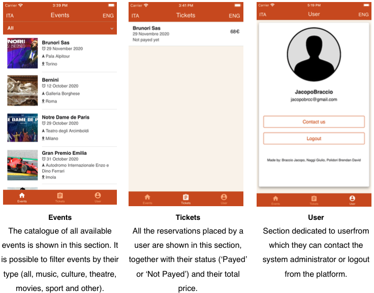
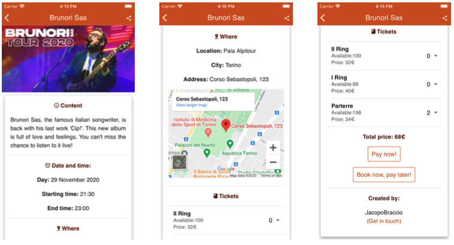
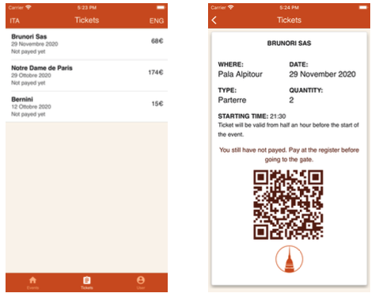

#EventsByPolito - Mobile application
Project and Laboratory on Embedded Communication Systems - ICT4SS @politecnicoditorino - 2019/2020
Developed in collaboration with Brendan David Polidori and Giulio Naggi.

##Introduction 
The proposed project aims at the creation of an event booking platform. The platform will have a catalogue with different kinds of events (musical, cultural, movies, etc.) inserted by some promoters. Clients can access the catalogue through different devices (mobile phone, personal computer, dedicated terminal) and book/buy tickets for the events in which they are interested in. Once the ticket is bought, it will be virtually available to the user who can then scan it through a custom-made gate, located in the event’s site, in order to access the event.

This repo contains the code of the mobile application only. 

:arrow_right: [Full project description here](/source/PLECS.pdf)

##Technical Description of the application
The application is developed using **Apache Cordova mobile development framework**. Cordova allows the use of standard web technologies (HTML5, CSS3 and JavaScript) for cross-platform development. Applications execute within wrappers targeted to each platform, and rely on standards- compliant API bindings to access each device's capabilities such as sensors, data, network status, etc. Therefore, the developed applications can be installed both on iOS and Android. The user interface was built using **Onsen UI** that is a large set of rich UI components specifically designed for mobile apps. Onsen UI enriches app users’ mobile experience with natively designed UI elements: components change their aspects according to the platform on which they are running, so it’s perfect for developing hybrid apps using Cordova or developing mobile web apps (also referred to as Progressive Web Apps).
The communication between the applications and the web-server takes place using a series of developed **REST APIs** and exchange of **JSONs**.

##Functionalities
The application dedicated to the customer is made of 3 main sections: Events, Tickets and User:  
 
By clicking on one of the proposed events, a page dedicated to the chosen event opens. by scrolling through the page, customers have the opportunity to see some details about the event, such as its content, date and time, where it is going to take place, who has created the event and the kind of tickets available along with their available quantities. Eventually, customers can place a reservation or make a purchase using Stripe.
 
 
Once a reservation has been correctly placed, a success message will be displayed, and the reservation appears under the ‘Tickets’ section. By clicking on a reservation, the page containing the tickets is opened. 
The ticket page contains the QR code related to the reservation, some information about the event and if it has been paid or not. This page is then going to be scanned at the access gate. 
 

##Tools used
List of the tools and technologies used in this project 
- `Cordova framework`
- `JavaScript`
- `HTML`
- `CSS`
- `FLASK`
- `jQuery`
- `PostgreSQL`
- `REST API`